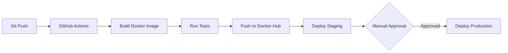

# Guide de Déploiement CI/CD - EduPass-MG

## 📋 Introduction

Ce guide détaille la mise en place d'une chaîne d'intégration et de déploiement continue (CI/CD) pour **EduPass-MG**, une application Laravel avec PostgreSQL, Redis et Queue Workers.

### Objectifs

Chaque `git push` sur la branche `main` déclenche automatiquement :

1. ✅ **Tests automatisés** (PHPUnit, Pest)
2. 🐳 **Construction de l'image Docker**
3. 📦 **Push sur Docker Hub**
4. 🧪 **Déploiement en staging**
5. 🚀 **Déploiement en production** (après validation)

---

## 🏗️ Architecture



**Stack Technique** :
- **Application** : Laravel 11, PHP 8.2
- **Base de données** : PostgreSQL 15
- **Cache/Queue** : Redis 7
- **Web Server** : Nginx + PHP-FPM
- **Orchestration** : Docker Compose
- **CI/CD** : GitHub Actions

---

## 📁 Structure des Fichiers

```
EduPass-MG/
├── .github/
│   └── workflows/
│       └── ci-cd.yml           # Pipeline CI/CD
├── docker/
│   ├── Dockerfile              # Image Laravel
│   ├── nginx/
│   │   └── default.conf        # Config Nginx
│   └── php/
│       └── php.ini             # Config PHP
├── docker-compose.yml          # Orchestration locale
├── docker-compose.prod.yml     # Orchestration production
└── deployment/
    ├── deploy.sh               # Script de déploiement
    └── .env.production.example # Variables d'environnement
```

---

## 🐳 Étape 1 : Créer le Dockerfile

### `docker/Dockerfile`

```dockerfile
FROM php:8.2-fpm

# Install system dependencies
RUN apt-get update && apt-get install -y \
    git \
    curl \
    libpng-dev \
    libonig-dev \
    libxml2-dev \
    libpq-dev \
    libzip-dev \
    zip \
    unzip \
    nginx \
    supervisor \
    && docker-php-ext-install pdo pdo_pgsql pgsql mbstring exif pcntl bcmath gd zip

# Install Composer
COPY --from=composer:latest /usr/bin/composer /usr/bin/composer

# Install Node.js (for asset compilation)
RUN curl -fsSL https://deb.nodesource.com/setup_20.x | bash - \
    && apt-get install -y nodejs

# Set working directory
WORKDIR /var/www/html

# Copy application files
COPY . .

# Install PHP dependencies
RUN composer install --no-dev --optimize-autoloader

# Install Node dependencies and build assets
RUN npm ci && npm run build

# Set permissions
RUN chown -R www-data:www-data /var/www/html/storage /var/www/html/bootstrap/cache

# Copy Nginx configuration
COPY docker/nginx/default.conf /etc/nginx/sites-available/default

# Copy Supervisor configuration
COPY docker/supervisor/supervisord.conf /etc/supervisor/conf.d/supervisord.conf

# Expose port
EXPOSE 80

# Start Supervisor
CMD ["/usr/bin/supervisord", "-c", "/etc/supervisor/conf.d/supervisord.conf"]
```

---

## ⚙️ Étape 2 : Configuration Nginx

### `docker/nginx/default.conf`

```nginx
server {
    listen 80;
    server_name _;
    root /var/www/html/public;

    index index.php index.html;

    location / {
        try_files $uri $uri/ /index.php?$query_string;
    }

    location ~ \.php$ {
        fastcgi_pass 127.0.0.1:9000;
        fastcgi_index index.php;
        fastcgi_param SCRIPT_FILENAME $realpath_root$fastcgi_script_name;
        include fastcgi_params;
    }

    location ~ /\.(?!well-known).* {
        deny all;
    }

    client_max_body_size 20M;
}
```

---

## 🔧 Étape 3 : Configuration Supervisor

### `docker/supervisor/supervisord.conf`

```ini
[supervisord]
nodaemon=true
user=root

[program:nginx]
command=/usr/sbin/nginx -g "daemon off;"
autostart=true
autorestart=true
stdout_logfile=/dev/stdout
stdout_logfile_maxbytes=0
stderr_logfile=/dev/stderr
stderr_logfile_maxbytes=0

[program:php-fpm]
command=/usr/local/sbin/php-fpm -F
autostart=true
autorestart=true
stdout_logfile=/dev/stdout
stdout_logfile_maxbytes=0
stderr_logfile=/dev/stderr
stderr_logfile_maxbytes=0

[program:laravel-worker]
process_name=%(program_name)s_%(process_num)02d
command=php /var/www/html/artisan queue:work redis --sleep=3 --tries=3 --max-time=3600
autostart=true
autorestart=true
numprocs=2
user=www-data
stdout_logfile=/var/www/html/storage/logs/worker.log
```

---

## 🐙 Étape 4 : Docker Compose

### `docker-compose.prod.yml`

```yaml
version: '3.8'

services:
  app:
    image: ${DOCKER_USERNAME}/edupass-mg:${IMAGE_TAG:-latest}
    container_name: edupass-app
    restart: unless-stopped
    ports:
      - "${APP_PORT:-8080}:80"
    environment:
      - APP_ENV=production
      - APP_DEBUG=false
      - DB_HOST=postgres
      - REDIS_HOST=redis
    depends_on:
      - postgres
      - redis
    networks:
      - edupass-network

  postgres:
    image: postgres:15-alpine
    container_name: edupass-postgres
    restart: unless-stopped
    environment:
      POSTGRES_DB: ${DB_DATABASE}
      POSTGRES_USER: ${DB_USERNAME}
      POSTGRES_PASSWORD: ${DB_PASSWORD}
    volumes:
      - postgres-data:/var/lib/postgresql/data
    networks:
      - edupass-network

  redis:
    image: redis:7-alpine
    container_name: edupass-redis
    restart: unless-stopped
    volumes:
      - redis-data:/data
    networks:
      - edupass-network

volumes:
  postgres-data:
  redis-data:

networks:
  edupass-network:
    driver: bridge
```

---

## 🚀 Étape 5 : GitHub Actions Workflow

### `.github/workflows/ci-cd.yml`

```yaml
name: CI/CD Pipeline

on:
  push:
    branches: [ main ]
  pull_request:
    branches: [ main ]

env:
  IMAGE_NAME: ${{ secrets.DOCKER_USERNAME }}/edupass-mg
  STAGING_HOST: ${{ secrets.STAGING_HOST }}
  PRODUCTION_HOST: ${{ secrets.PRODUCTION_HOST }}

jobs:
  test:
    name: Run Tests
    runs-on: ubuntu-latest
    
    services:
      postgres:
        image: postgres:15
        env:
          POSTGRES_DB: edupass_test
          POSTGRES_USER: postgres
          POSTGRES_PASSWORD: password
        options: >-
          --health-cmd pg_isready
          --health-interval 10s
          --health-timeout 5s
          --health-retries 5
        ports:
          - 5432:5432
      
      redis:
        image: redis:7-alpine
        options: >-
          --health-cmd "redis-cli ping"
          --health-interval 10s
          --health-timeout 5s
          --health-retries 5
        ports:
          - 6379:6379

    steps:
      - uses: actions/checkout@v4

      - name: Setup PHP
        uses: shivammathur/setup-php@v2
        with:
          php-version: '8.2'
          extensions: mbstring, pdo, pdo_pgsql, redis
          coverage: xdebug

      - name: Copy .env
        run: cp .env.example .env

      - name: Install Composer Dependencies
        run: composer install --prefer-dist --no-progress

      - name: Generate Application Key
        run: php artisan key:generate

      - name: Run Migrations
        env:
          DB_CONNECTION: pgsql
          DB_HOST: localhost
          DB_PORT: 5432
          DB_DATABASE: edupass_test
          DB_USERNAME: postgres
          DB_PASSWORD: password
        run: php artisan migrate --force

      - name: Run Tests
        env:
          DB_CONNECTION: pgsql
          DB_HOST: localhost
          DB_PORT: 5432
          DB_DATABASE: edupass_test
          DB_USERNAME: postgres
          DB_PASSWORD: password
        run: php artisan test

  build:
    name: Build Docker Image
    runs-on: ubuntu-latest
    needs: test
    if: github.event_name == 'push' && github.ref == 'refs/heads/main'

    steps:
      - uses: actions/checkout@v4

      - name: Set up Docker Buildx
        uses: docker/setup-buildx-action@v3

      - name: Login to Docker Hub
        uses: docker/login-action@v3
        with:
          username: ${{ secrets.DOCKER_USERNAME }}
          password: ${{ secrets.DOCKER_TOKEN }}

      - name: Build and Push
        uses: docker/build-push-action@v5
        with:
          context: .
          file: docker/Dockerfile
          push: true
          tags: |
            ${{ env.IMAGE_NAME }}:latest
            ${{ env.IMAGE_NAME }}:${{ github.sha }}
          cache-from: type=registry,ref=${{ env.IMAGE_NAME }}:buildcache
          cache-to: type=registry,ref=${{ env.IMAGE_NAME }}:buildcache,mode=max

  deploy-staging:
    name: Deploy to Staging
    runs-on: ubuntu-latest
    needs: build
    environment: staging

    steps:
      - uses: actions/checkout@v4

      - name: Deploy to Staging Server
        uses: appleboy/ssh-action@v1.0.0
        with:
          host: ${{ secrets.STAGING_HOST }}
          username: ${{ secrets.STAGING_USER }}
          key: ${{ secrets.STAGING_SSH_KEY }}
          script: |
            cd /home/deploy/edupass-mg
            docker-compose -f docker-compose.prod.yml pull
            docker-compose -f docker-compose.prod.yml up -d
            docker-compose -f docker-compose.prod.yml exec -T app php artisan migrate --force
            docker-compose -f docker-compose.prod.yml exec -T app php artisan config:cache
            docker-compose -f docker-compose.prod.yml exec -T app php artisan route:cache
            docker-compose -f docker-compose.prod.yml exec -T app php artisan view:cache

  deploy-production:
    name: Deploy to Production
    runs-on: ubuntu-latest
    needs: deploy-staging
    environment: production
    if: github.event_name == 'push' && github.ref == 'refs/heads/main'

    steps:
      - uses: actions/checkout@v4

      - name: Deploy to Production Server
        uses: appleboy/ssh-action@v1.0.0
        with:
          host: ${{ secrets.PRODUCTION_HOST }}
          username: ${{ secrets.PRODUCTION_USER }}
          key: ${{ secrets.PRODUCTION_SSH_KEY }}
          script: |
            cd /home/deploy/edupass-mg
            docker-compose -f docker-compose.prod.yml pull
            docker-compose -f docker-compose.prod.yml up -d
            docker-compose -f docker-compose.prod.yml exec -T app php artisan migrate --force
            docker-compose -f docker-compose.prod.yml exec -T app php artisan config:cache
            docker-compose -f docker-compose.prod.yml exec -T app php artisan route:cache
            docker-compose -f docker-compose.prod.yml exec -T app php artisan view:cache
            docker-compose -f docker-compose.prod.yml exec -T app php artisan queue:restart
```

---

## 🔐 Étape 6 : Configurer les Secrets GitHub

Aller sur : `https://github.com/YOUR_USERNAME/EduPass-MG/settings/secrets/actions`

### Secrets Requis

| Nom du Secret | Description | Exemple |
|---------------|-------------|---------|
| `DOCKER_USERNAME` | Nom d'utilisateur Docker Hub | `karibo01` |
| `DOCKER_TOKEN` | Token d'accès Docker Hub | `dckr_pat_...` |
| `STAGING_HOST` | IP du serveur staging | `192.168.1.100` |
| `STAGING_USER` | Utilisateur SSH staging | `deploy` |
| `STAGING_SSH_KEY` | Clé privée SSH staging | `-----BEGIN RSA...` |
| `PRODUCTION_HOST` | IP du serveur production | `100.112.134.63` |
| `PRODUCTION_USER` | Utilisateur SSH production | `deploy` |
| `PRODUCTION_SSH_KEY` | Clé privée SSH production | `-----BEGIN RSA...` |

---

## 🖥️ Étape 7 : Préparer les Serveurs

### Sur le serveur Staging

```bash
# Créer l'utilisateur deploy
sudo useradd -m -s /bin/bash deploy
sudo usermod -aG docker deploy

# Créer le dossier de déploiement
sudo mkdir -p /home/deploy/edupass-mg
sudo chown deploy:deploy /home/deploy/edupass-mg

# Copier docker-compose.prod.yml
scp docker-compose.prod.yml deploy@STAGING_HOST:/home/deploy/edupass-mg/

# Créer le fichier .env
ssh deploy@STAGING_HOST
cd /home/deploy/edupass-mg
nano .env  # Remplir avec les variables d'environnement
```

### Sur le serveur Production

```bash
# Mêmes étapes que staging
sudo useradd -m -s /bin/bash deploy
sudo usermod -aG docker deploy
sudo mkdir -p /home/deploy/edupass-mg
sudo chown deploy:deploy /home/deploy/edupass-mg
```

---

## 📝 Étape 8 : Variables d'Environnement

### `.env.production.example`

```env
APP_NAME="EduPass-MG"
APP_ENV=production
APP_KEY=base64:GENERATE_WITH_php_artisan_key:generate
APP_DEBUG=false
APP_URL=https://edupass.mg

DB_CONNECTION=pgsql
DB_HOST=postgres
DB_PORT=5432
DB_DATABASE=edupass_prod
DB_USERNAME=edupass_user
DB_PASSWORD=STRONG_PASSWORD_HERE

REDIS_HOST=redis
REDIS_PASSWORD=null
REDIS_PORT=6379

QUEUE_CONNECTION=redis
CACHE_DRIVER=redis
SESSION_DRIVER=redis

MAIL_MAILER=smtp
MAIL_HOST=smtp.gmail.com
MAIL_PORT=587
MAIL_USERNAME=your-email@gmail.com
MAIL_PASSWORD=your-app-password
MAIL_ENCRYPTION=tls
MAIL_FROM_ADDRESS=noreply@edupass.mg
MAIL_FROM_NAME="${APP_NAME}"

# MVola API
MVOLA_CLIENT_ID=your_client_id
MVOLA_CLIENT_SECRET=your_client_secret
MVOLA_MERCHANT_MSISDN=034XXXXXXX
```

---

## 🚀 Étape 9 : Premier Déploiement

1. **Pousser le code** :
   ```bash
   git add .
   git commit -m "Setup CI/CD pipeline"
   git push origin main
   ```

2. **Suivre l'exécution** :
   - Aller sur GitHub → Actions
   - Observer les étapes : Test → Build → Deploy Staging → Deploy Production

3. **Vérifier les déploiements** :
   - Staging : `http://STAGING_HOST:8080`
   - Production : `https://edupass.mg`

---

## 🔍 Dépannage

### Logs du serveur

```bash
# Logs de l'application
docker-compose -f docker-compose.prod.yml logs -f app

# Logs PostgreSQL
docker-compose -f docker-compose.prod.yml logs -f postgres

# Logs Redis
docker-compose -f docker-compose.prod.yml logs -f redis

# Logs Laravel
docker-compose -f docker-compose.prod.yml exec app tail -f storage/logs/laravel.log
```

### Commandes utiles

```bash
# Redémarrer les services
docker-compose -f docker-compose.prod.yml restart

# Reconstruire l'image
docker-compose -f docker-compose.prod.yml up -d --build

# Exécuter des commandes Artisan
docker-compose -f docker-compose.prod.yml exec app php artisan migrate
docker-compose -f docker-compose.prod.yml exec app php artisan queue:work
```

---

## ✅ Checklist de Déploiement

- [ ] Dockerfile créé et testé localement
- [ ] docker-compose.prod.yml configuré
- [ ] Workflow GitHub Actions créé
- [ ] Secrets GitHub configurés
- [ ] Serveurs préparés (staging + production)
- [ ] Variables d'environnement définies
- [ ] Premier push réussi
- [ ] Tests automatisés passent
- [ ] Staging accessible
- [ ] Production accessible
- [ ] SSL configuré (Let's Encrypt)
- [ ] Monitoring mis en place

---

## 📚 Ressources

- [Documentation Laravel Deployment](https://laravel.com/docs/11.x/deployment)
- [Docker Hub](https://hub.docker.com/)
- [GitHub Actions](https://docs.github.com/en/actions)
- [PostgreSQL Docker](https://hub.docker.com/_/postgres)

---

**Auteur** : EduPass-MG Team  
**Date** : Janvier 2026  
**Version** : 1.0
